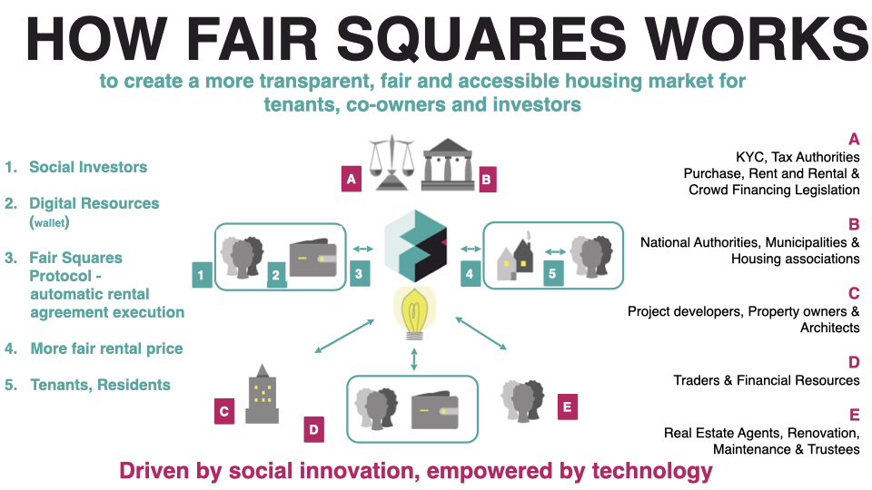

<div align="center">
  <a href="https://discord.gg/5u3dxE49V5">
    
  </a>
  <a href="https://twitter.com/FairSquares">
    
  </a>
</div>


# Fair Squares (FS)
## Goal of FS
FS directly connects supply and demand of house-owners & renters and houses & investors. It removes the financial barrier of investing in real estate for investors that don't have the means to fully invest in a house themselves. <br>
<br>
Investors would invest in them to get a return on rent and to own a fractional part of an asset. The project is still in it's research and development phase, we are looking to align and build it with similar minded institutions and actors that value a fair housing.
<br>

Goal is to give investors a social return while renters can have cheapers housing. In between the end-users, there is of of coordination between stakeholders to achieve this system so it's safe and the desired outcome is achieved.

The FS is essentially a DAO with a mission to make housing cheaper, that relies and requires real world actors to achieve it's goal. The real world actors  the following real-world actors to fullfill tasks and get paid out by the digital society. 



examples:
- A council that is on a mission to achieve fair housing
- Real world actors that can check property and valuate them e.g. appraisers
- Other actors such a service agents to guide renters and help to asses the state of a house. 

While trying to achieve the above, the FS protocol also needs to standardize the usage so other 3rd parties can plugin. 

- Standardized onboarding of assets and fractionalizing them. 
- Registering shareholders of entities in live registeries
- Verified Roles & Governance

We are zooming much more on the problem definition, stakeholders and the solution in our paper on our [website](https://fair-squares.nl/). To learn more and get in touch with us, please join our [discord channel FS](https://discord.gg/5u3dxE49V5)


## How to run & build
### Running locally
1. complete the [basic Rust setup instructions](./docs/rust-setup.md).
1. `cargo run  --release -- --dev --tmp` in the root of the fs-node repo.

### Published image on docker-hub
`docker run -p 9944:9944 ilhanu/fs-node-apac:latest fs-node --ws-external --dev --tmp`

### Build

The `cargo run` command will perform an initial build. Use the following command to build the node
without launching it:

```sh
cargo build --release
```
### Connect with Polkadot-JS Apps Front-end

Once the node template is running locally, you can connect it with **Polkadot-JS Apps** front-end
to interact with your chain. [Click
here](https://polkadot.js.org/apps/#/explorer?rpc=ws://localhost:9944) connecting the Apps to your
local node template.

### Run in Docker

First, install [Docker](https://docs.docker.com/get-docker/) and
[Docker Compose](https://docs.docker.com/compose/install/).

Then run the following command to start a single node development chain.

```bash
./scripts/docker_run.sh
```

This command will firstly compile your code, and then start a local development network. You can
also replace the default command
(`cargo build --release && ./target/release/fs-node --dev --ws-external`)
by appending your own. A few useful ones are as follow.

```bash
# Run Substrate node without re-compiling
./scripts/docker_run.sh ./target/release/fs-node --dev --ws-external

# Purge the local dev chain
./scripts/docker_run.sh ./target/release/fs-node purge-chain --dev

# Check whether the code is compilable
./scripts/docker_run.sh cargo check
```
